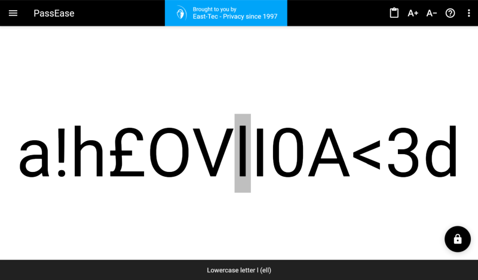

# PassEase

PassEase makes it easy to see, handle, copy, and share passwords. It clearly shows tricky characters, so you don't mix up O with 0 or l with I. This cuts down on mistakes. If you struggle to remember long passwords, PassEase breaks them into smaller bits to help. It's a handy tool for techies and non-techies alike, as well as for elderly or visually impaired people. Need to show a password in class or at a meeting? PassEase makes that simple. Plus, if you've ever had to copy a password from one gadget to another without sending it, this tool can help. Best of all, it works online, so there's nothing to download or install. And being open-source, everyone can see how it works and trust it.

